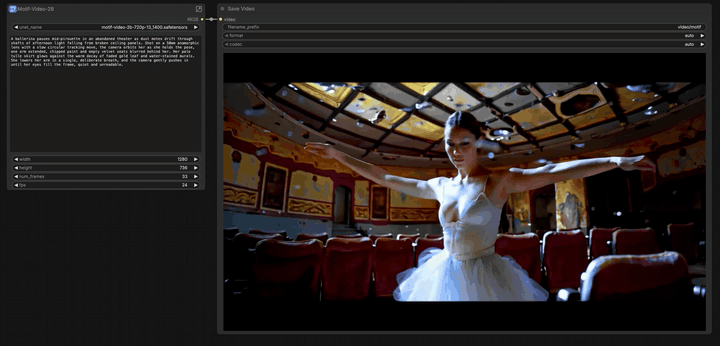

<p align="center">
  
</p>

<p align="center">
  <h1 align="center">ComfyUI-MotifVideo2B</h1>
</p>

<p align="center">
  <b>Official ComfyUI custom nodes for the Motif-Video 2B text-to-video diffusion transformer</b>
</p>

<p align="center">
  <a href="https://arxiv.org/abs/2604.16503">Technical Report</a> &nbsp;|&nbsp;
  <a href="https://huggingface.co/Motif-Technologies/Motif-Video-2B">Hugging Face</a> &nbsp;|&nbsp;
  <a href="https://motiftech.io/videoshowcase">Project Page</a>
</p>


---

## Introduction

`ComfyUI-MotifVideo2B` exposes Motif Technologies' Motif-Video 2B text-to-video and image-to-video diffusion transformer as a set of ComfyUI custom nodes, so the model plugs directly into the standard `Load Diffusion Model → KSampler → VAE Decode` graph.

Motif-Video 2B is a flow-matching diffusion transformer organized around a three-stage DDT-style backbone (dual-stream + single-stream + DDT decoder) with **Shared Cross-Attention** for long-context text alignment. The architectural derivation and full training recipe are in the [Motif-Video 2B technical report](https://arxiv.org/abs/2604.16503); this repository ships the inference-time ComfyUI integration.

These nodes are first-class citizens of ComfyUI's memory manager: FP8 weight conversion, CPU offload, and attention-backend auto-selection (Flash / cuDNN / xFormers) are all delegated to the engine rather than reimplemented. What this repository adds on top is MotifVideo-specific glue: the T5Gemma2 text encoder, the Wan-family 3D VAE in diffusers layout, a TeaCache accelerator, and an Image-to-Video conditioning node.

<p align="center">
  
</p>

---

## Features

- **Load Diffusion Model** compatibility — loads the transformer through ComfyUI's stock `Load Diffusion Model` node, with full FP8 (`fp8_e4m3fn`) support
- **Load MotifVideo Text Encoder** — exposes the T5Gemma2 text encoder as a standard ComfyUI `CLIP` object
- **MotifVideo Text Encode** — convenience node that takes a positive prompt and a negative prompt in a single node and emits paired positive / negative `CONDITIONING`
- **Empty MotifVideo Latent** — creates an empty video latent (default 1280×736, 121 frames) sized for the Wan-family VAE
- **Load MotifVideo VAE** — loads the 3D video VAE in diffusers layout and remaps the state-dict keys to ComfyUI's WAN VAE at load time
- **MotifVideo TeaCache** — plug-in TeaCache accelerator that reuses the previous step's output when the timestep-modulated L1 distance between successive inputs falls below a threshold
- **MotifVideo Image Encode** — Image-to-Video conditioning: VAE-encodes the input image and injects it into the conditioning as `concat_latent_image`
- **MotifVideoUnetLoaderGGUF** — experimental GGUF loader for `general.architecture=motif_video` files (see the Performance section for why GGUF is not recommended)
- Delegates memory management, CPU offload, FP8 weight conversion, and attention-backend selection to ComfyUI's built-in systems — no parallel implementation

---

## Installation

### 1. Install the custom nodes

```bash
cd /path/to/ComfyUI/custom_nodes
git clone https://github.com/MotifTechnologies/ComfyUI-MotifVideo2B.git
pip install -r ComfyUI-MotifVideo2B/requirements.txt
```

`motif_core` and `motif-pipelines` do not need to be installed separately — `MotifVideoTransformer3DModel` is bundled under `models/transformer/`, so the repository is self-contained.

### 2. Download the model weights from Hugging Face

All weights live on the official Hugging Face repository:

- 🤗 <https://huggingface.co/Motif-Technologies/Motif-Video-2B>

Download the files listed below and place them under ComfyUI's standard model directories. The filenames and target directories shown here are the ones the example workflows load by default — pick your own names if you prefer, but keep the target directory the same.

```
ComfyUI/
├── models/
│   ├── diffusion_models/
│   │   └── motifvideo_2b.safetensors         ← transformer/diffusion_pytorch_model.safetensors
│   ├── text_encoders/
│   │   ├── motifvideo_t5gemma2/                ← text_encoder/ (entire directory)
│   │   └── motifvideo_tokenizer/               ← tokenizer/ (entire directory)
│   └── vae/    
│       └── motifvideo_vae.safetensors          ← vae/diffusion_pytorch_model.safetensors
```

The easiest way to fetch all of them at once is `huggingface-cli`:

```bash
huggingface-cli download Motif-Technologies/Motif-Video-2B \
  --local-dir /tmp/motif-video-2b
# then copy or move the four pieces into the directories shown above
```

The VAE is in diffusers layout; its `state_dict` keys are remapped to ComfyUI's WAN VAE at load time, so no manual conversion is needed.

---

## Usage

### Recommended: launch ComfyUI with `--highvram`

On a host with enough VRAM (H200 or similar), use `--highvram`:

```bash
python main.py --highvram --listen 0.0.0.0 --port 8188
```

- Without `--highvram` (default `NORMAL_VRAM`): a bf16 workflow runs at roughly **222 s/step** — the transformer is placed on the "staged" path and weights are dispatched every forward.
- With `--highvram`: **30 s/step** — all weights stay resident on the GPU.

**Why.** On hosts where ComfyUI's `comfy_aimdo` (`DynamicVRAM`) is active, models whose leaves use `comfy.ops.*` are automatically routed to the staged path under `NORMAL_VRAM`, which means weight dispatch on every forward. This repository's transformer deliberately uses `comfy.ops.*` end-to-end so that `fp8`/`manual_cast` paths work, which means the staging cannot be disabled at the model level. The engine-side workaround is `--highvram`. Tracked in #26.


---

## Nodes

| Node | Inputs | Outputs | Description |
|------|--------|---------|-------------|
| Load MotifVideo Text Encoder | clip_name, dtype | CLIP | Loads the T5Gemma2 encoder and exposes it as a ComfyUI `CLIP` |
| MotifVideo Text Encode | CLIP, text, negative_prompt | CONDITIONING × 2 | Encodes positive and negative prompts in a single node |
| Empty MotifVideo Latent | width, height, num_frames, batch_size | LATENT | Empty video latent sized for the Wan-family VAE |
| Load MotifVideo VAE | vae_name | VAE | Loads the 3D VAE in diffusers layout with automatic key remapping |
| MotifVideo Image Encode | positive, negative, VAE, IMAGE | CONDITIONING × 2 | I2V: VAE-encodes the input image and injects it into the conditioning |

---

## Workflow

```
[Load Diffusion Model]          → motifvideo_1.9b (bf16/fp8)
         ↓ MODEL
[MotifVideo TeaCache]           → MODEL (TeaCache applied)
         ↓ MODEL
[Load MotifVideo Text Encoder]  → motifvideo_t5gemma2/model.safetensors
         ↓ CLIP
[MotifVideo Text Encode]        → positive + negative prompts
         ↓ positive, negative
[Empty MotifVideo Latent]       → 1280x736, 121 frames
         ↓ LATENT
[KSampler]                      ← MODEL + positive + negative + LATENT
         ↓ LATENT
[Load MotifVideo VAE]           → motifvideo_vae.safetensors
         ↓ VAE
[VAE Decode]                    → video output
```

---

## Performance

Measured on a single H200 with the default 1280×736, 121-frame workflow:

| Setup | VRAM peak | s/step | Notes |
|-------|-----------|--------|-------|
| bf16 + `--highvram` | ~30 GB | 30 s | Baseline |
| **fp8_e4m3fn + `--highvram`** | **~28 GB** | **~31 s** | **Recommended** production path |
| fp8 + `NORMAL_VRAM` | — | — | Avoid — staged path and earlier fallback regression can re-emerge |

---

## Image-to-Video

Insert a `MotifVideo Image Encode` node between `MotifVideo Text Encode` and `KSampler` to run in I2V mode:

```
[LoadImage]                     → input image
         ↓ IMAGE
[MotifVideo Image Encode]       ← VAE + positive + negative
         ↓ positive, negative (concat_latent_image injected)
[KSampler]                      ← MODEL + modified conditioning + LATENT
```

- Recommended I2V parameters: `ModelSamplingSD3` shift = 15, KSampler cfg = 8.0.
- To go back to T2V, remove the `MotifVideo Image Encode` node and wire `MotifVideo Text Encode` straight into `KSampler`.

---

## Workflows

Reference workflows live under `workflows/`:

- `workflows/Motif-2B_T2V_example.json` — default Text-to-Video starter graph.
- `workflows/Motif-2B_I2V_example.json` — Image-to-Video starter graph.

Load either JSON from ComfyUI's **Load** menu; all nodes referenced above are wired up. Make sure the model files described in the Installation section are in place first.

---

## Citation

If you use Motif-Video 2B in your research, please cite the technical report:

```bibtex
@techreport{motifvideo2b2026,
  title       = {Motif-Video 2B: Technical Report},
  author      = {Motif Technologies},
  year        = {2026},
  institution = {Motif Technologies},
  url         = {https://arxiv.org/abs/2604.16503}
}
```

---

## License

This repository is released under the **Apache 2.0** License. See `LICENSE` for details.
